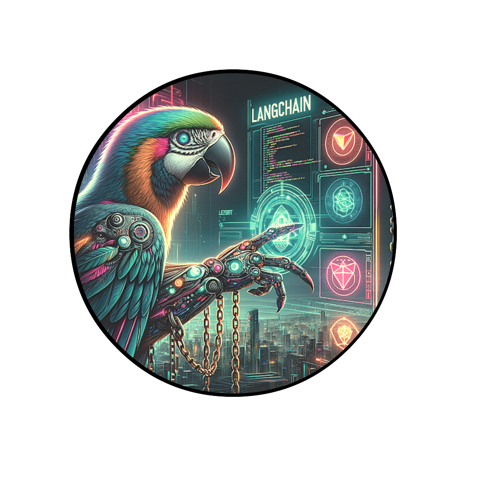

## Commit Message: "Enhanced README documentation for improved clarity and understanding"

# LangChain 🦜 🔗: demo


*A cybernetic parrot navigates through neon-lit chains amidst a futuristic cityscape, symbolizing the LangChain technology's seamless integration of nature and advanced data processing. The detailed artwork highlights the parrot's journey as it interacts with dynamic data visualizations, unlocking new connections in a narrative of innovation and technology.*

LangChain leverages OpenAI's API within a flexible architecture, allowing developers to seamlessly integrate various components like pre-trained language models and data storage solutions. This framework simplifies the creation of chatbots, automated writing assistants, and a wide range of natural language processing tools.


## LangChain Workflow: Steps to Success

1. Aggregate diverse datasets including job listings, articles, code snippets, and social media content.
2. Vectorize and process the data, develop a model, refine through training and testing, and finally deploy.
3. Employ machine learning techniques to query the dataset with a language model.
4. Interact with the model to gain insights and answers from the data.

## Initialize OpenAI with Node.js

```bash

npm install openai

curl https://api.openai.com/v1/models \
  -H "Authorization: Bearer $OPENAI_API_KEY" \
  -H "OpenAI-Organization: org-9PKnn7txwxhPDTNvTe3ZL164"

curl https://api.openai.com/v1/chat/completions \
  -H "Content-Type: application/json" \
  -H "Authorization: Bearer $OPENAI_API_KEY" \
  -d '{
     "model": "gpt-3.5-turbo",
     "messages": [{"role": "user", "content": "This is a test message."}],
     "temperature": 0.7
   }'
```

## Set Up OpenAI and LangChain with Python

```bash
pip install openai
```

> Access your API keys at: [Your API Key-here](https://platform.openai.com/account/api-keys)

```bash
cd your_project_directory
echo "OPENAI_API_KEY=YOUR_API_KEY_HERE" > .env
```

> Insert your actual OpenAI API key in place of YOUR_API_KEY_HERE.

> Save the .env file.

```bash
source .env
echo "OPENAI_API_KEY=${OPENAI_API_KEY:0:5}..."
```

## Execution

```bash
conda activate langchain
python src/my_openai.py
python src/llm_example.py
```

## Credits

- LangChain draws inspiration from [Hugging Face](https://huggingface.co/), [OpenAI](https://openai.com/), and the capabilities of [GPT-3](https://openai.com/blog/gpt-3-apps/).
- We utilize OpenAI's [API](https://beta.openai.com/docs/api-reference/introduction) for text generation.

---

## Crafting a Language Model Application with LLMs

```python
# filename: openai_llm.py
from langchain.llms import OpenAI
llm = OpenAI(model_name="text-ada-001", n=2, best_of=2)

llm("Tell me a joke")
# 'Why did the chicken cross the road? To get to the other side.'

llm_result = llm.generate(["Tell me a joke", "Tell me a poem"]*15)

len(llm_result.generations)
30
llm_result.generations[0]
```

```bash
python openai_llm.py
```

> Alternatively, use Hugging Face's Transformers:

```bash
pip install transformers
```

---

## Getting Started with Modular Abstractions: "chains"

```python
from langchain.prompts import PromptTemplate
from langchain.llms import OpenAI

llm = OpenAI(temperature=0.9)
prompt = PromptTemplate(
    input_variables=["product"],
    template="What is a good name for a company that makes {product}?",
)
```

```python
from langchain.chains import LLMChain
chain = LLMChain(llm=llm, prompt=prompt)

# Execute the chain with the specified input variable.
print(chain.run("colorful socks"))
```

```python
from langchain.chat_models import ChatOpenAI
from langchain.prompts.chat import (
    ChatPromptTemplate,
    HumanMessagePromptTemplate,
)
human_message_prompt = HumanMessagePromptTemplate(
        prompt=PromptTemplate(
            template="What is a good name for a company that makes {product}?",
            input_variables=["product"],
        )
    )
chat_prompt_template = ChatPromptTemplate.from_messages([human_message_prompt])
chat = ChatOpenAI(temperature=0.9)
chain = LLMChain(llm=chat, prompt=chat_prompt_template)
print(chain.run("colorful socks"))
```

```python
second_prompt = PromptTemplate(
    input_variables=["company_name"],
    template="Write a catchphrase for the following company: {company_name}",
)
chain_two = LLMChain(llm=llm, prompt=second_prompt)
```

```python
from langchain.chains import SimpleSequentialChain
overall_chain = SimpleSequentialChain(chains=[chain, chain_two], verbose=True)

# Execute the chain with the input variable for the first chain.
catchphrase = overall_chain.run("colorful socks")
print(catchphrase)
```

```python
from langchain.chains import LLMChain
from langchain.chains.base import Chain

from typing import Dict, List


class ConcatenateChain(Chain):
    chain_1: LLMChain
    chain_2: LLMChain

    @property
    def input_keys(self) -> List[str]:
        # Combine the input keys from both chains.
        all_input_vars = set(self.chain_1.input_keys).union(set(self.chain_2.input_keys))
        return list(all_input_vars)

    @property
    def output_keys(self) -> List[str]:
        return ['concat_output']

    def _call(self, inputs: Dict[str, str]) -> Dict[str, str]:
        output_1 = self.chain_1.run(inputs)
        output_2 = self.chain_2.run(inputs)
        return {'concat_output': output_1 + output_2}
```

```python
prompt_1 = PromptTemplate(
    input_variables=["product"],
    template="What is a good name for a company that makes {product}?",
)
chain_1 = LLMChain(llm=llm, prompt=prompt_1)

prompt_2 = PromptTemplate(
    input_variables=["product"],
    template="What is a good slogan for a company that makes {product}?",
)
chain_2 = LLMChain(llm=llm, prompt=prompt_2)

concat_chain = ConcatenateChain(chain_1=chain_1, chain_2=chain_2)
concat_output = concat_chain.run("colorful socks")
print(f"Concatenated output:\n{concat_output}")
```

Stay tuned for updates and feel free to contribute!

## References

Here are some resources that have been invaluable in the development of LangChain:

- [OpenAI API Documentation](https://beta.openai.com/docs/api-reference/introduction)
- [Hugging Face Model Hub](https://huggingface.co/models)
- [GPT-3 Creative Applications](https://openai.com/blog/gpt-3-apps/)

We encourage you to explore these resources to learn more about language models and their applications.
